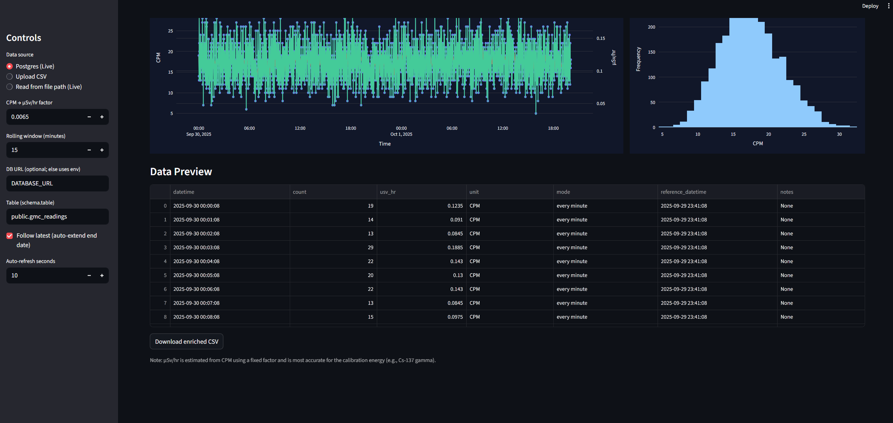

# GeigerCounter

Quick and dirty dashboard for the 
[GQ GMC-SE Geiger Counter](https://www.gqelectronicsllc.com/comersus/store/comersus_viewItem.asp?idProduct=5845) using [Streamlit](https://docs.streamlit.io/), [pandas](https://pandas.pydata.org/docs/), [plotly](https://plotly.com/python/), and [pygmc](https://github.com/Wikilicious/pygmc). 




To use this dashboard

Clone the repo:
```bash
git clone https://github.com/djjohns/GeigerCounter.git
```

Install the dependencies:
```bash
pip install -r requirements.txt
```

Run the get_device_log.py script:
```bash
python get_device_log.py
```

This will write a csv file to the data directory in the repo called 
``GMC-SE_YYYYMMDD.csv``

Run the Streamlit app:
```bash
streamlilt run app.py
```

This should automatically open up the dashboard in your default browser. If not
the dashboard can be found at:
http://localhost:8501/

Once the dashboard is up and running you can upload the csv file that was 
created earlier or point the dashboard to the filepath to where the file is 
located.

This is by no means a production ready app and should be treated as such. Once 
again this is just something quick and dirty to replace the 90's era interface 
that the is provided from the device's manufacture.